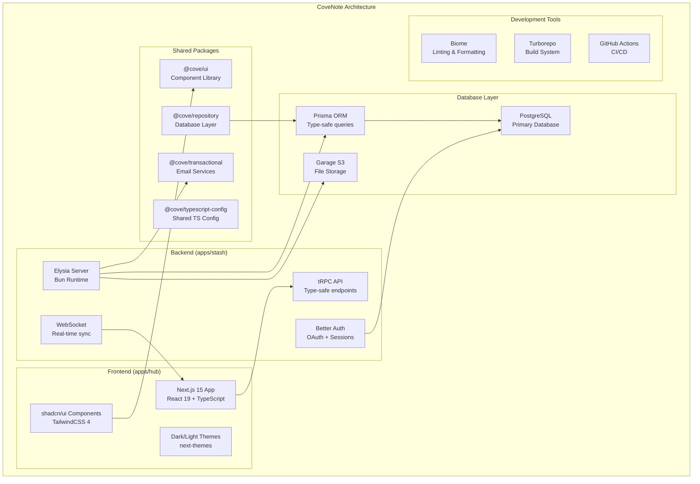

# CoveNote 📝

[](https://coderabbit.ai)
[](https://github.com/PejeDev/CoveNote/actions/workflows/code-quality.yml)
[](LICENSE)
[](https://bun.sh)

> Digital chaos? Nah. Your cozy spot for notes, tasks, and not losing your mind. Solo or squad. It's 💯 Open Source.

## 🌟 Overview

CoveNote is your digital sanctuary for organizing thoughts, tasks, and ideas. Whether you're flying solo or collaborating with a team, CoveNote provides a clean, intuitive interface to keep your digital life organized and stress-free.

Built as a modern monorepo with cutting-edge tools, CoveNote offers a seamless experience across web platforms with real-time collaboration, smart organization, and beautiful UI components.

## ✨ Features

- 📝 **Smart Note Taking**: Rich text editing with markdown support and real-time collaboration
- ✅ **Task Management**: Organize tasks with workspaces, favorites, and advanced categorization
- 👥 **Team Collaboration**: Multi-tenant workspaces with role-based access control
- 🔍 **Powerful Search**: AI-powered search across all your content
- 🎨 **Beautiful Interface**: Modern UI with dark/light themes and customizable layouts
- 🔒 **Secure Authentication**: OAuth integration with GitHub and secure session management
- 🌐 **Real-time Sync**: WebSocket-powered real-time updates across devices
- 📊 **Rich Media Support**: File uploads, images, and S3-compatible storage

## 🏗️ Architecture

CoveNote is built as a monorepo using modern tools and follows a modular architecture:

```
apps/
  hub/          # Next.js frontend application
  stash/        # Elysia API backend with tRPC
packages/
  shared/
    ui/         # Shared UI components (shadcn/ui)
    typescript-config/  # Shared TypeScript configurations
  stash/
    repository/ # Database layer with Prisma
    transactional/ # Email/notification services
```

### System Architecture



## 🚀 Getting Started

### Prerequisites

- [Bun](https://bun.sh) (latest version)
- [Docker](https://docker.com) (for database)
- Git

### Installation

1. Clone the repository:
   ```bash
   git clone https://github.com/PejeDev/CoveNote.git
   cd CoveNote
   ```

2. Install dependencies:
   ```bash
   bun install
   ```

3. Start the database services:
   ```bash
   cd apps/stash
   docker compose up -d
   ```

4. Set up environment variables:
   ```bash
   cp .env.example .env
   # Edit .env with your configuration
   ```

5. Start the development servers:
   ```bash
   # Start the API server
   cd apps/stash
   bun run dev

   # In a new terminal, start the frontend
   cd apps/hub
   bun run dev
   ```

## 🛠️ Tech Stack

### Frontend
- **Framework**: Next.js 15 with React 19
- **Styling**: TailwindCSS 4 with shadcn/ui components
- **Type Safety**: TypeScript with strict configuration
- **State Management**: React hooks and context
- **Themes**: next-themes for dark/light mode

### Backend
- **Runtime**: Bun with Elysia framework
- **API**: tRPC for type-safe APIs
- **Authentication**: Better Auth with OAuth providers
- **WebSockets**: Real-time communication
- **Validation**: Zod schemas

### Database & Storage
- **Database**: PostgreSQL with Prisma ORM
- **File Storage**: S3-compatible storage (Garage)
- **Caching**: Built-in Bun caching

### Development Tools
- **Monorepo**: Turborepo for build optimization
- **Linting**: Biome for formatting and linting
- **CI/CD**: GitHub Actions
- **Package Manager**: Bun workspaces

## 🧑‍💻 Development

### Code Quality

This project uses strict code quality tools:

```bash
# Type checking
bun run check-types

# Linting and formatting
bun run fmt-lint

# Run all quality checks
bun run ci
```

### Project Structure

- **Apps**: Independent applications (hub, stash)
- **Packages**: Shared libraries and configurations
- **Monorepo**: Managed with Turborepo for optimal builds
- **Type Safety**: End-to-end type safety with tRPC and TypeScript

### Database Management

```bash
# Generate Prisma client
cd packages/stash/repository
bun prisma generate

# Run migrations
bun prisma migrate dev

# View database
bun prisma studio
```

## 🤝 Contributing

We welcome contributions! Here's how to get started:

1. Fork the repository
2. Create a feature branch: `git checkout -b feature/amazing-feature`
3. Make your changes and ensure tests pass
4. Run code quality checks: `bun run fmt-lint`
5. Commit your changes: `git commit -m 'Add amazing feature'`
6. Push to the branch: `git push origin feature/amazing-feature`
7. Open a Pull Request

Please ensure your code follows our style guide and passes all quality checks.

## 📝 License

This project is licensed under the MIT License - see the [LICENSE](LICENSE) file for details.

## 📞 Support & Community

- 🐛 **Issues**: [GitHub Issues](https://github.com/PejeDev/CoveNote/issues)
- 💡 **Feature Requests**: [GitHub Discussions](https://github.com/PejeDev/CoveNote/discussions)
- 📖 **Documentation**: Coming soon
- 🔧 **Development**: Check our [GitHub Project](https://github.com/PejeDev/CoveNote/projects)

## 🙏 Acknowledgments

- Built with modern web technologies and best practices
- UI components powered by [shadcn/ui](https://ui.shadcn.com)
- Icons by [Lucide](https://lucide.dev)
- Inspired by tools like Notion, Obsidian, and Linear

---

Made with ❤️ by [Juan Castañeda](https://github.com/PejeDev)